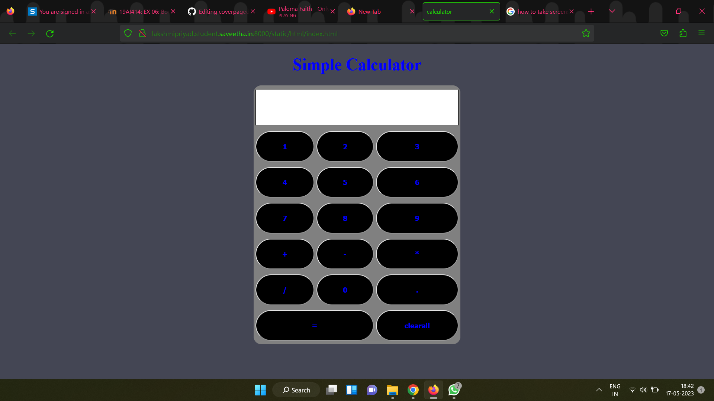

# Design of a Standard Calculator

## AIM:

To design a web application for a standard calculator.

## DESIGN STEPS:

### Step 1:
Create a new Django project using  "django-admin startproject",get into the project terminal  and use "python3 manage.py startapp" command.

### Step 2:
Define  urls.py and views.py for the website .Allow host access and add the app name under installed 

### Step 3:
Create a templates folder under the app folder followed by a folder under templates with the app name followed by html file named calculator.html

### Step 4:
Write HTML and CSS code in the file save it and run the app using python manage.py makemigrations and python manage.py migrate commands .Run the Server using "python3 manage.py runserver 0:80" command.

### Step 5:
 Validate the HTML and CSS code.
### Step 6:
Publish the website in the given URL.

## PROGRAM :
```
<!DOCTYPE html>
<html>
  <head>
    <title>calculator</title>
    <style type="text/css">
      body {
        background-color: #444654;
      }
      table {
        border: 1px solid grey;
        background-color: grey;
        margin-left: auto;
        margin-right: auto;
        border-radius: 15px;
        height: 500px;
        width: 50px;
      }
      input[type="text"] {
        border: 1px solid black;
        padding: 20px 30px;
        font-size: 24px;
        font-weight: bold;
        border-radius: 2px;
        width: 330px;
      }

      input[type="button"] {
        color: blue;

        font-weight: bold;
        width: 100%;
        padding: 20px 40px;
        background-color: black;

        border-radius: 50px;
      }
      input[type="button"]:hover {
        transform: translateY(-5px);
        transition: transform 0.3s ease-in-out;
        color: #2fe3bd;
        background-color: #444654;
      }
    </style>
  </head>
  <body>
    <form name="form1" onload="result.value=''">
      <h1 style="text-align: center; color: blue">Simple Calculator</h1>
      <table id="calc">
        <tr>
          <td colspan="3">
            <input type="text" id="result" />
          </td>
        </tr>
        <tr>
          <td><input type="button" value="1" onclick="result.value+='1'" /></td>
          <td><input type="button" value="2" onclick="result.value+='2'" /></td>
          <td><input type="button" value="3" onclick="result.value+='3'" /></td>
        </tr>
        <tr>
          <td><input type="button" value="4" onclick="result.value+='4'" /></td>
          <td><input type="button" value="5" onclick="result.value+='5'" /></td>
          <td><input type="button" value="6" onclick="result.value+='6'" /></td>
        </tr>
        <tr>
          <td><input type="button" value="7" onclick="result.value+='7'" /></td>
          <td><input type="button" value="8" onclick="result.value+='8'" /></td>
          <td><input type="button" value="9" onclick="result.value+='9'" /></td>
        </tr>
        <tr>
          <td><input type="button" value="+" onclick="result.value+='+'" /></td>
          <td><input type="button" value="-" onclick="result.value+='-'" /></td>
          <td><input type="button" value="*" onclick="result.value+='*'" /></td>
        </tr>
        <tr>
          <td><input type="button" value="/" onclick="result.value+='/'" /></td>
          <td><input type="button" value="0" onclick="result.value+='0'" /></td>
          <td><input type="button" value="." onclick="result.value+='.'" /></td>
        </tr>

        <tr>
          <td colspan="2">
            <input
              type="button"
              value="="
              onclick="result.value=eval(result.value)"
            />
          </td>
          <td colspan="1">
            <input
              type="button"
              value="clearall"
              id="clear"
              onclick="result.value=''"
            />
          </td>
        </tr>
      </table>
    </form>
  </body>
</html>

```

## OUTPUT:

## Result:
Thus we designed a web application for a standard calculator.
